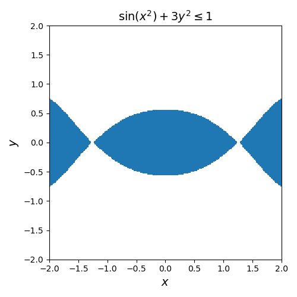
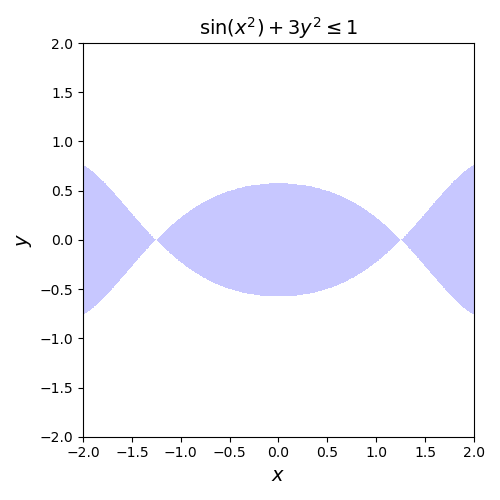
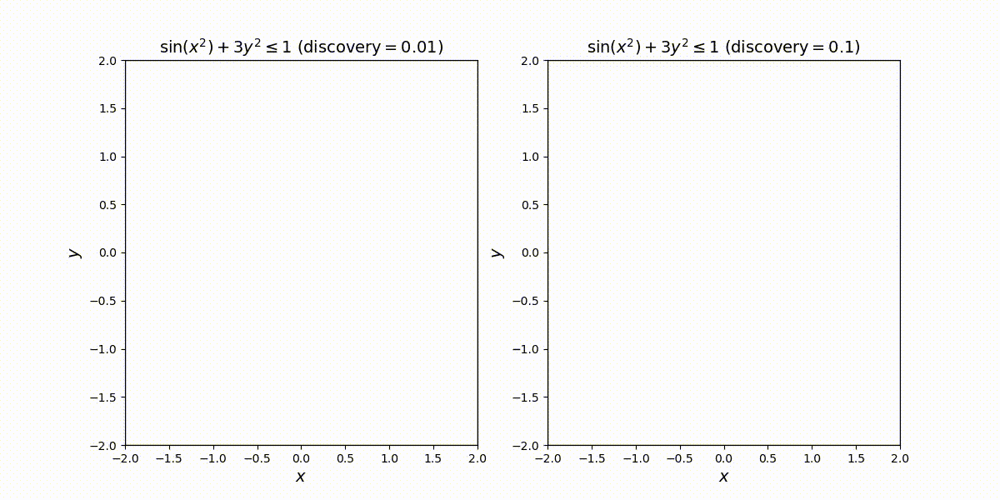

# region_plot
A function for plotting (two-dimensional) regions of points that satisfy a given predicate.

## Installation
Currently, the easist approach for installing `region_plot` is to clone from github and run `pip install` locally. 

~~~sh
git clone https://github.com/cetinkaya/region_plot.git
pip install --user region_plot/
~~~

## Use
To plot the region `{(x,y) : sin(x^2)+3y^2 <= 1}` we can write:

~~~python
import numpy as np
import matplotlib.pyplot as pl
import region_plot as rp

def example0():
    def pred(x, y):
        return np.sin(x*x) + 3*y*y <= 1
    pl.figure(figsize=(5, 5))
    rp.region_plot(pred, (-2, 2), (-2, 2))
    pl.xlabel("$x$", fontsize=14)
    pl.ylabel("$y$", fontsize=14)
    pl.title("$\sin(x^2)+3y^2 \leq 1$", fontsize=14)
    pl.tight_layout()
    pl.savefig("example0.png")

example0()
~~~

which results in the following image:

Here we have plotted the region within the rectangle `{(x,y) : -2 <= x,y <= 2}` by passing the arguments `(-2, 2), (-2, 2)`. 

### Subdivisions

`region_plot` works by evaluating the given predicate (`sin(x^2)+3y^2 <= 1`) at different points. We can partly control the evaluation procedure through the parameters `discovery` and `nof_subdivisions`. 

Initially, `region_plot` evaluates the predicate at the corner points of the initial rectangle. Then the initial rectangle is divided into smaller rectangles and those smaller rectangles can be divided further. Here the parameter `nof_subdivisions` controls how many times in total the rectangles are divided. If the corners of a small enough rectangle all satisfy the predicate, then the predicate is considered to be true in all points in the rectangle. This can introduce errors. To improve the approximation of the region, more points may need to be evaluated. The function `region_plot` ranks all current rectangles to choose which rectangle to subdivide. The parameter `discovery` affects this ranking and Increasing the `discovery` parameter increases the subdivision ranking of rectangles whose corners all satisfy (or all fail to satisfy) the predicate. In addition, to `discovery` and `nof_subdivisions`, other arguments be passed to change the style of the plot. For instance, the color and the transparency of the region can be changed by using `facecolor` and `alpha` parameters.

~~~python
import numpy as np
import matplotlib.pyplot as pl
import region_plot as rp

def example1():
    def pred(x, y):
        return np.sin(x*x) + 3*y*y <= 1
    pl.figure(figsize=(5, 5))
    rp.region_plot(pred, (-2, 2), (-2, 2), discovery=0.01, nof_subdivisions=5000, facecolor="#9090FF", alpha=0.5)
    pl.xlabel("$x$", fontsize=14)
    pl.ylabel("$y$", fontsize=14)
    pl.title("$\sin(x^2)+3y^2 \leq 1$", fontsize=14)
    pl.tight_layout()
    pl.savefig("example1.png")

example1()
~~~

In this case we obtain:

### Effect of `discovery`

To see the effect of `discovery` parameter, consider the following example where the animation shows the evaluated rectangles for `discovery` values `0.01` and `0.1`:

~~~python
import numpy as np
import matplotlib.pyplot as pl
import matplotlib.animation as animation
import region_plot as rp

def animate(v=0):
    def pred(x, y):
        return np.sin(x*x) + 3*y*y <= 1
    sp = pl.subplot(1, 2, 1)
    pl.title("$\sin(x^2)+3y^2 \leq 1\,\,(\\mathrm{discovery}=0.01)$", fontsize=14)
    rp.region_plot(pred, (-2, 2), (-2, 2), discovery = 0.01, nof_subdivisions=v, show_all=True, edgecolor="#000000", facecolor="#9090FF", alpha=0.5)
    pl.xlabel("$x$", fontsize=14)
    pl.ylabel("$y$", fontsize=14)
    sp = pl.subplot(1, 2, 2)
    rp.region_plot(pred, (-2, 2), (-2, 2), discovery = 0.1, nof_subdivisions=v, show_all=True, edgecolor="#000000", facecolor="#9090FF", alpha=0.5)
    pl.xlabel("$x$", fontsize=14)
    pl.ylabel("$y$", fontsize=14)
    pl.title("$\sin(x^2)+3y^2 \leq 1\,\,(\\mathrm{discovery}=0.1)$", fontsize=14)

fig = pl.figure(figsize=(12, 6))
ani = animation.FuncAnimation(fig, animate, frames=200)
ani.save("example2.mp4")
~~~

from which we obtain the following animation

